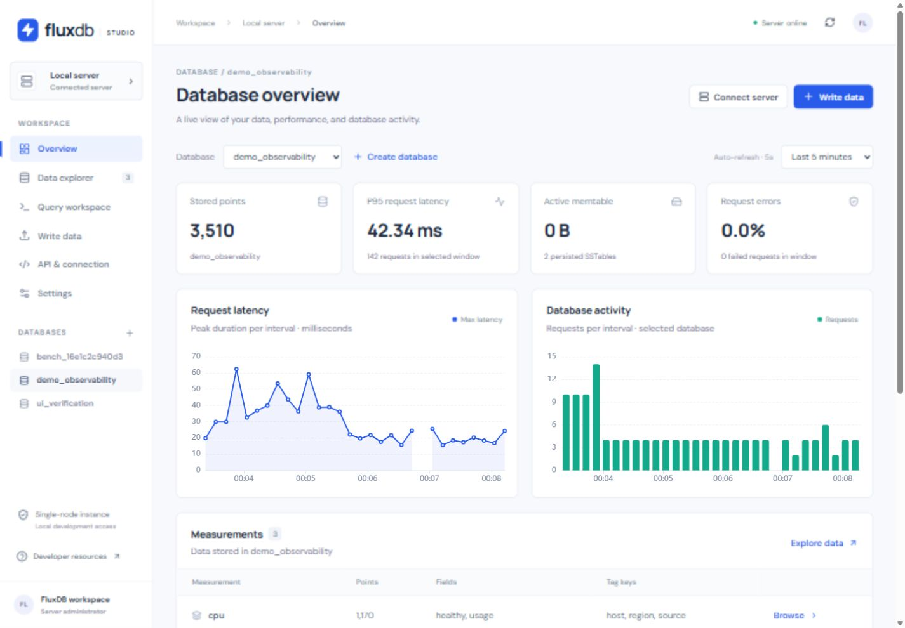

# FluxDB

A single-node time-series database in Rust, with a browser administration console, typed HTTP APIs, and observable storage operations. The console replaces the previous Electron application.



## Run locally

For a public resume demo, follow the [free VM deployment guide](docs/FREE_DEPLOYMENT.md), including HTTPS, persistent storage, and the read-only public gateway.

Install Rust 1.89+ (1.96 tested), Node.js 22.12+ (24 tested), and optionally Python 3.10+ for the SDK, demo, backup restore, and smoke tests.

The one-command development launcher builds the server, installs missing browser dependencies, waits for both services, and stops them together:

```sh
node start-all.js
```

Open **http://127.0.0.1:5173**. Windows users can also run `run-fluxdb.bat`; Linux/macOS users can run `bash run-fluxdb.sh`. Run `npm ci` in `fluxdb-studio` after dependency-lockfile changes. The launcher refuses occupied ports rather than stopping another service. `node start-all.js --verify` starts both services, checks readiness, then exits. Optional `FLUXDB_STUDIO_PORT` changes the browser port.

To run each service separately instead:

From the repository root, start the server:

```sh
cd fluxdb
cargo run --release -p fluxdb-server --bin fluxdb
```

In a second terminal, from the repository root:

```sh
cd fluxdb-studio
npm ci
npm run dev
```

Open **http://127.0.0.1:5173**. The local development proxy connects to **http://127.0.0.1:8086**. Create a database, write points, explore data, and run SQL. Open **Developer resources** in the sidebar for the complete searchable guide, copyable commands, endpoint reference, and SDK examples.

The server stores data in `data` relative to its working directory (`fluxdb/data` with the commands above). Use an absolute `FLUXDB_DATA_DIR` when running as a service. A data directory can be opened by only one process.

To populate actual stored sample data and generate real request telemetry, run from the repository root:

```sh
python scripts/demo.py --seconds 60
```

The demo creates `demo_observability` with explicitly labeled synthetic CPU, memory, and HTTP measurements. Select that database in the console. Charts use API responses; they do not display fabricated server statistics.

## Gemini agent setup

Open **Ask AI → Assistant settings** on any page. Enter a Gemini API key and a model ID available to your API project. Click **Check key & load available models** to verify access and choose a returned model ID. Session keys stay in browser memory and must be re-entered after reload. Obtain a key from [Google AI Studio](https://aistudio.google.com/apikey); check [API billing and quotas](https://ai.google.dev/gemini-api/docs/billing) for that project.

For a shared server key, create **`.env` in the repository root** (next to `start-all.js`):

```dotenv
GEMINI_API_KEY=your_api_key_here
GEMINI_MODEL=gemini-2.5-pro
```

Restart the backend after changing `.env`. `node start-all.js`, the Rust server, and Docker Compose load this configuration. Real environment variables take precedence. Never put provider keys in `VITE_*` variables or commit `.env`. The FluxDB bearer token is a separate database administration credential.

Copilot inspects real schema and can perform bounded SELECT reads when **Allow read-only data analysis** is enabled. It prepares runnable SQL, point writes/upserts/deletions, database creation/deletion, retention, flush, compaction, and exports. Review cards show the exact target and payload; mutations require confirmation, and destructive operations require typing the database name. SQL can open directly in Query workspace and writes in the JSON writer. Local API results are available for follow-up analysis with row-sharing enabled.

Example: “Inspect my schema, find the latest 10 CPU points, and propose a query.” For writes: “Prepare a current cpu point for host api-01 with usage 42.8.” Follow with an exact identity to update a point. These are independent reviewed operations, not an autonomous transaction or shell agent.

See **Developer resources → AI agent & Gemini setup**, the [system prompt](docs/ASSISTANT_SYSTEM_PROMPT.md), and [architecture](docs/ARCHITECTURE.md) for limits and privacy. An endpoint 404 means the running backend needs updating; key, quota, model, and network failures produce actionable messages. Transient provider HTTP 502/503/504 responses are retried up to twice with backoff within the existing turn deadline. Persistent outages require selecting another available model or waiting; retries cannot guarantee provider availability. Never paste a key into chat.

## What works

- **Typed time-series storage:** measurement, complete tag set, nanosecond timestamp, and float, signed 64-bit integer, string, or boolean fields. Rewriting an identity merges fields; supplied fields replace existing values.
- **Durability:** checksummed write-ahead log, immediate sync by default, recovery of interrupted trailing writes, corruption detection, typed compressed SSTables, atomic checkpoint manifests, tombstones, and compaction.
- **Database operations:** create/list/drop, batch upsert, paginated reads, exact-series or tag-filtered time-range deletion, schema discovery, flush, compaction, retention, and full JSON snapshot export/restore.
- **SQL subset:** SELECT, field/tag predicates, AND/OR/NOT, IN, BETWEEN, LIKE, IS NULL, DISTINCT, ordering, limits, offsets, aggregates, and fixed time buckets. Unsupported operations return errors. See the guide for the supported grammar.
- **Browser console:** saved server addresses, in-memory credentials, database selector, live request latency and error charts, schema inventory, data explorer with edit/delete, field charts, SQL results/history, JSON import/export, retention and maintenance controls.
- **Developer access:** versioned HTTP API, OpenAPI document at `/api/v1/openapi.json`, JavaScript and Python clients, line-protocol ingestion, and an offline Rust CLI.
- **Operational controls:** bearer authentication, explicit CORS origins, 2 MiB request bodies, 10,000-point batches, 32 concurrent requests, health checks, graceful shutdown, and container configuration.

## API quick start

The following examples use Bash syntax. In PowerShell, use the Python/JavaScript SDK examples in Developer resources, or `Invoke-RestMethod` with a JSON body.

```sh
curl -X POST http://127.0.0.1:8086/api/v1/databases/observability

curl -X POST http://127.0.0.1:8086/api/v1/databases/observability/points   -H 'Content-Type: application/json'   -d '{"points":[{"measurement":"cpu","tags":{"host":"api-01"},"timestamp":"1789142400000000123","fields":{"usage":42.8,"healthy":true,"requests":{"integer":"1200"}}}]}'

curl 'http://127.0.0.1:8086/api/v1/databases/observability/points?limit=100'

curl -X POST http://127.0.0.1:8086/api/v1/databases/observability/query -H 'Content-Type: application/json' -d '{"query":"SELECT MEAN(usage) FROM cpu"}'
```

When authentication is enabled, add `-H 'Authorization: Bearer YOUR_TOKEN'`. Timestamps are decimal nanosecond **strings**, and exact integer fields use `{"integer":"1200"}`. JSON numbers represent floating-point fields. Query integer cells are also returned as strings.

A point update is an upsert of the same measurement, tags, and timestamp. Changing tags or time creates a different point. Delete uses an inclusive start/end range; `exact: true` matches the complete tag set. Deleting or retention-expiring a point removes all its fields.

See [the OpenAPI reference](docs/openapi.json), [JavaScript client](sdk/javascript/fluxdb.mjs), [Python client](sdk/python/fluxdb.py), and the browser's Developer resources for all CRUD, error handling, import, and administration examples.

## Configuration

| Variable | Default | Purpose |
| --- | --- | --- |
| `FLUXDB_ADDR` | `127.0.0.1:8086` | IP address and port to listen on |
| `FLUXDB_DATA_DIR` | `data` | Persistent storage directory |
| `FLUXDB_TOKEN` | unset | Shared bearer token; at least 32 characters required for non-loopback binding |
| `FLUXDB_CORS_ORIGINS` | localhost/127.0.0.1 ports 5173 and 4173 | Comma-separated browser origins |

For PowerShell, set variables before launching the server:

```powershell
$env:FLUXDB_DATA_DIR = "C:/fluxdb-data"
$env:FLUXDB_TOKEN = "YOUR_RANDOM_TOKEN_AT_LEAST_32_CHARACTERS"
$env:FLUXDB_ADDR = "127.0.0.1:8086"
cd fluxdb
cargo run --release -p fluxdb-server --bin fluxdb
```

Use the connection dialog to enter a server URL and token. Saved profiles contain addresses, not tokens. Tokens must be entered again after a page reload. Health endpoints are public; data and monitoring endpoints require the configured token.

## Container deployment

1. Copy `.env.example` to `.env`.
2. Replace the placeholder token with a random secret (generate one with `python -c "import secrets; print(secrets.token_hex(32))"`).
3. Run `docker compose up --build -d`.
4. Open **http://localhost:8080**. In Connect server, use `http://localhost:8080` and your token.

The web container proxies requests to the Rust server. Only port 8080 is published, bound to loopback; the database volume persists across container restarts. Put an HTTPS reverse proxy in front of the web container for remote access and set CORS origins for any separately hosted console. Do not expose a development Vite server as the public deployment.

```sh
docker compose logs -f
docker compose ps
docker compose down
```

`docker compose down` retains the database volume; adding `--volumes` deletes it. Docker is not installed in the development environment used for this revision, so the container build and Linux runtime still need verification on the deployment host.

## Backups and maintenance

Use **Database settings → Export snapshot** for a consistent logical snapshot containing typed points and retention policy. Store snapshots outside the database data directory. Restore into a new database:

```sh
python scripts/restore.py snapshot.json --database restored --url http://127.0.0.1:8086
```

The restore tool reads `FLUXDB_TOKEN`, writes bounded batches, verifies point counts, compacts, and applies retention last. Restore is not transactional across batches; if interrupted, inspect the partially created destination and retry into a new database. Applying a retention policy may immediately expire old restored data on the next maintenance sweep.

Retention is measured against wall-clock time and enforced approximately every 60 seconds. A value of zero retains data indefinitely. Compact reclaims obsolete point versions and tombstones. Do not copy live WAL/SSTable files independently as a backup.

The CLI is for offline use. Stop the server before opening the same data directory:

```sh
cd fluxdb
cargo run -p fluxdb-cli -- --data-dir ./data list
cargo run -p fluxdb-cli -- --data-dir ./data query observability "SELECT COUNT(*) FROM cpu"
```

## Verification and performance

```sh
cd fluxdb
cargo fmt --all -- --check
cargo test --workspace --locked
cargo build --release --workspace --locked
cd ..
python scripts/smoke.py
cd fluxdb-studio
npm ci
npm run build
npm audit
```

The smoke suite creates an isolated temporary authenticated server, exercises CRUD, precise integer round trips, SQL, invalid-batch rejection, CORS, snapshot restore, process restarts, durable deletion, OpenAPI, and both SDKs. It cleans up only its own temporary directory.

To measure your own host, with a server running:

```sh
python scripts/benchmark.py --points 10000 --batch 500
```

The report includes the workload size, platform, HTTP point throughput, batch write p95, query p95, and verified stored count. The benchmark leaves its database for inspection. These are workload-specific measurements, not a universal throughput claim.

CI definitions run Rust tests on Windows and Linux and build the browser application. A workflow definition is not evidence of a successful hosted CI run.

See [the verification record](docs/VERIFICATION.md) for local results and the measured workload.

## Architecture and limits

Read [the architecture and durability notes](docs/ARCHITECTURE.md).

This is a portfolio-scale, single-node database implementation. It does **not** provide InfluxDB feature parity, the Flux language, clustering, replication, multi-user RBAC, multi-database transactions, continuous queries, or high availability. The current reader materializes SSTables and query snapshots in memory; large datasets and high-cardinality workloads require further indexing, streaming, and performance work. Export is also memory-bound.

Metrics are a bounded in-memory history of the last 2,000 application requests, reset on restart. They describe server processing time, not network latency, CPU utilization, disk IOPS, or long-term monitoring. Dashboard polling endpoints are excluded from latency samples, while data/schema requests remain observable.

Tests reduce regressions but cannot establish zero bugs or production readiness for every workload. Validate capacity, backups, restore, fault behavior, HTTPS, and deployment configuration for your environment before relying on the database for critical data.
