<div align="center">

# ⚡ FluxDb
### High-Performance LSM-Based Distributed Database System


<p align="center">
  <b>FluxDb</b> is a next-generation storage engine built for speed, reliability, and observability. <br/>
  Featuring a robust <b>LSM-Tree architecture</b>, advanced <b>visual query planning</b>, and a beautiful <b>Studio UI</b>.
</p>

[Getting Started](#-getting-started) • [Architecture](#-architecture) • [Features](#-features) • [Studio](#-fluxdb-studio)

</div>

---

## 🚀 Overview

FluxDb is engineered from the ground up to provide a seamless development experience without compromising on performance. By combining a high-performance **Rust** core with a modern **Electron**-based Studio, FluxDb offers the best of both worlds: raw metal speed and intuitive visual management.

### Key Highlights
- **🔥 Blazing Fast Writes**: Optimized LSM-Tree storage engine with MemTable and WAL.
- **🛡️ ACID Compliance**: MVCC (Multi-Version Concurrency Control) and robust transaction management.
- **📊 Visual Intelligence**: Real-time query execution plans and storage visualization.
- **🛠️ Developer First**: Integrated Monaco editor, syntax highlighting, and dark mode UI.

---

## 🏗 Architecture

FluxDb uses a modular architecture separating the storage layer from the query processing and client interfaces.

```mermaid
graph TD
    subgraph "Client Layer"
        Studio["🖥️ FluxDb Studio"]
        CLI["💻 FluxDb CLI"]
    end

    subgraph "FluxDb Server (Rust)"
        Networking["📡 Network Handler (TCP/Wire)"]
        
        subgraph "Query Engine"
            Parser["📝 SQL Parser"]
            Planner["🧠 Query Planner"]
            Executor["⚡ Query Executor"]
        end

        subgraph "Storage Engine (LSM-Tree)"
            MemTable["📦 MemTable (SkipList)"]
            WAL["📝 Write-Ahead Log"]
            SSTables["💾 SSTables (Disk)"]
            Compactor["🧹 Background Compaction"]
        end
    end

    Studio --> Networking
    CLI --> Networking
    Networking --> Parser
    Parser --> Planner
    Planner --> Executor
    Executor <--> MemTable
    Executor <--> SSTables
    MemTable -.->|Flush| SSTables
    MemTable -.->|Log| WAL
    Compactor -.->|Optimize| SSTables
```



### 🔄 Query Execution Flow

How FluxDb processes your SQL commands:


---

## ✨ Features

### 🧠 Core Engine
- **LSM-Tree Storage**: efficient write-heavy workloads with background compaction.
- **Transactions**: Full ACID support with MVCC for snapshot isolation.
- **SQL Support**: Advanced parser supporting `SELECT`, `INSERT`, `UPDATE`, `DELETE`, and `WHERE` clauses.
- **Pluggable Compression**: Support for Snappy/LZ4 block compression in SSTables.

### 🎨 FluxDb Studio
The official GUI for FluxDb, built with **React** and **Electron**.
- **Interactive Query Editor**: Monaco-based editor with SQL syntax highlighting and auto-complete.
- **Query Visualizer**: See exactly how your queries are executed with graphical plans.
- **Table Explorer**: Browse schemas, indexes, and table statistics.
- **Server Metrics**: Real-time dashboards for throughput, latency, and resource usage.

---

## 🏁 Getting Started

### Prerequisites
- **Rust** (latest stable)
- **Node.js** & **npm** (for FluxDb Studio)

### Installation

1. **Clone the repository**
   ```bash
   git clone https://github.com/yourusername/fluxdb.git
   cd fluxdb
   ```

2. **Start the Database Server**
   ```bash
   cd fluxdb
   cargo run --release --bin fluxdb-server
   ```

3. **Launch fluxDb Studio**
   Open a new terminal:
   ```bash
   cd fluxdb-studio
   npm install
   npm run electron:dev
   ```

---

## 📖 Usage Examples

### SQL Shell
You can use the built-in CLI or the Studio to run queries.

```sql
-- Create a new table
CREATE TABLE users (
    id INT PRIMARY KEY,
    name STRING,
    email STRING
);

-- Insert data
INSERT INTO users VALUES (1, 'Alice', 'alice@fluxdb.dev');
INSERT INTO users VALUES (2, 'Bob', 'bob@fluxdb.dev');

-- Query data
SELECT * FROM users WHERE id = 1;

-- Analyze query performance
EXPLAIN SELECT * FROM users;
```

---

## 🛠️ Development

We welcome contributions! Please check out the `DEV_LOG.md` to see the latest updates and active development areas such as **Bloom Filters** and **Index Scans**.

### Running Tests
```bash
# Run core unit tests
cd fluxdb-core
cargo test

# Run integration tests
cargo test --test integration
```

---

<div align="center">
  <p>Made with ❤️ by Shravan</p>
  <i>Empowering developers with transparent data engines.</i>
</div>
