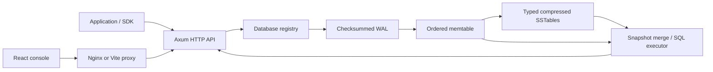

# Architecture and engineering notes

FluxDB is a single-process, single-node time-series database. Rust owns persistence and query execution; the React browser console is an HTTP client. Nginx provides the same-origin production web entry point.

## Data and consistency

A database contains measurements. Each series is identified by a measurement and a sorted complete set of string tags. A point identity is `(series, signed i64 nanosecond timestamp)`. Fields are float64, signed i64, string, or boolean. JSON timestamps and integer wrappers avoid JavaScript's 53-bit integer limit.

Writes to the same identity merge fields, with later supplied values winning. An empty internal field set is a tombstone; public writes cannot create one. Range deletion and retention persist tombstones so old SSTable values cannot reappear after restart. Deleting and then writing the same identity creates a new point without resurrecting deleted fields.

Each database has an operation read/write lock. Mutation, flush, and compaction take the write lock; queries and snapshots take a read lock. A query sees a coherent in-process view. A batch is validated before WAL append and becomes visible together under the operation lock. This does not provide multi-request or multi-database transactions.

The engine serializes database registry changes and holds filesystem locks on the data root and opened databases. Drop refuses a database with active external references, closes Windows file mappings, renames its directory to a hidden deletion directory, then reclaims files. A failed rename attempts to reopen the unchanged database. Hidden deletion directories left by a crash are ignored at startup and can be removed offline after confirming they are obsolete.

## Write path and recovery

1. Validate the full input batch and resolve field merges against the newest visible version.
2. Append one checksummed WAL record; the server's default policy syncs it immediately.
3. Publish the batch into the ordered memtable.
4. When the size threshold is reached, retain an immutable memtable until its SSTable is safely written and published.

The current `FLX2` SSTable stores sorted typed points, serialized with bincode, compressed with LZ4, and protected by CRC32. It preserves strings, booleans, and full-width integers. A reader for the previous format remains for existing files, but it cannot reconstruct types or values that an older writer already discarded. Back up old databases before migrating; new files cannot be read by old binaries.

Pending files are written and synced before rename. On Unix, publication also syncs the parent directory. Power-loss guarantees still depend on filesystem and device behavior; Windows does not use the same directory-sync mechanism. The suite tests process interruption and recovery, not every possible hardware failure.

Recovery validates record lengths and checksums. An incomplete final WAL record is truncated before future appends. A complete record with an invalid checksum fails startup instead of silently dropping data. SSTable/manifest corruption also fails startup. Diagnose and restore a backup rather than removing corrupt files blindly.

## Compaction checkpoint

Compaction merges all visible point versions and removes tombstones. It rotates the WAL, writes a new full snapshot SSTable, and atomically publishes a manifest containing `(snapshot_id, first_required_wal_segment)`. Only after publication does it switch the in-memory table set and reclaim obsolete files.

On recovery, the manifest selects the snapshot and newer tables and limits WAL replay to required segments. If a crash occurs before manifest publication, old data and WAL remain authoritative. If it occurs after publication, the new snapshot is authoritative. A manifest referencing a missing table is an error.

Automatic compaction runs when eight SSTables accumulate. Manual compaction is exposed through HTTP and the offline CLI. Retention maintenance runs approximately once per minute and compacts after expiring points. It uses the server clock and a strict `timestamp < cutoff` condition.

## Query execution

SQL is parsed by `sqlparser`, converted to an internal plan, and executed over the merged visible snapshot. Typed predicates preserve exact integer equality and implement missing-value three-valued logic for AND, OR, and NOT. Time comparisons preserve strict versus inclusive bounds. Time buckets use Euclidean division, including timestamps before the Unix epoch.

The public query endpoint accepts one SELECT statement. It supports field/tag projection, predicates, aggregates, DISTINCT, one ordering key, LIMIT/OFFSET, tag grouping, and quoted fixed intervals such as `time('1m')`. It does not execute JOINs, subqueries, set operations, computed expressions, HAVING, or arbitrary SQL DDL/DML. Use HTTP operations for mutations.

The storage format contains exact values, but numeric aggregate calculations use floating-point arithmetic. Avoid treating an aggregate sum of very large integers as an exact accounting result.

## HTTP, security, and observability

The versioned API has a 2 MiB body limit, 10,000-point batch limit, paginated reads up to 1,000 points, and a 32-request concurrency gate. Saturation returns 429. Input errors return structured errors; authentication failures return 401. CRUD handlers run storage work on Tokio's blocking pool.

Bearer authentication is optional on loopback and mandatory for non-loopback server binding. One token grants server-wide administration: there are no separate users, scopes, or read-only credentials. Terminate TLS at a reverse proxy, protect the token, and operate within that trust model. CORS is an explicit browser-origin allowlist, not an authentication boundary.

Request telemetry stores the latest 2,000 samples in memory. Each sample includes server duration, route, database when applicable, timestamp, and status. Health, stats, and telemetry polling are excluded. Other browser requests, including schema/data refreshes, count as real traffic. Samples reset on process restart and do not constitute a persistent monitoring system.

The console refreshes every five seconds, reports connectivity, scopes charts to the selected database/time window, and keeps credentials in memory. Point charts visualize the current data page; the table retains exact nanosecond strings even though chart axes use milliseconds.

## Scaling and operational boundaries

The current SSTable reader materializes typed points, and queries, schema scans, statistics, and snapshots allocate merged views. This is intentionally a small single-node implementation; memory, scan cost, and serialized mutation are practical limits. There is no distributed consensus, replication, sharding, failover, multi-user authorization, streaming export, or query cancellation on client disconnect.

Snapshot export is a consistent logical view, but restore is a sequence of batches into a new database. Request failures after a durable write can leave the client uncertain whether a mutation committed; inspect the point identity before retrying. Upserting identical point identities is safe for repeated value assignment. Retention and deletion are destructive and should be backed by tested snapshots.

The repository includes regression tests, an isolated authenticated end-to-end harness, SDK checks, a reproducible HTTP benchmark, container definitions, and CI configuration. These provide reviewable evidence; they do not substitute for load testing, fault injection, independent security review, or successful deployment-host validation.

## Gemini agent

The browser calls the authenticated `/api/v1/assistant/chat` route. Rust sends the bundled project instructions, selected database/page, and bounded conversation to Gemini's native generateContent function-calling API. The provider host is fixed; redirects and arbitrary provider URLs are disabled. A server `GEMINI_API_KEY` or per-request `x-gemini-api-key` supplies credentials. Secrets are never returned, persisted by the assistant, or logged. Browser session keys are memory-only; server keys are loaded from environment or a local .env at startup.

The tool loop preserves native model content and thought signatures between calls. `inspect_schema` returns names, types, tag keys, and counts. `read_query` requires explicit row-sharing consent, a SELECT plan, LIMIT 1..100, and a bounded serialized response. These limits bound returned context, not total storage scan cost. `propose_operation` validates allowlisted typed payloads and scope but never mutates storage. The browser displays the proposal and executes reviewed actions through the existing authenticated database endpoints. Destructive operations require the database name; successful cards cannot be executed twice. Lost responses still require checking actual state before retrying.

At most four Gemini turns and eight tool calls run per request, with four simultaneous assistant requests, 45-second provider timeouts, and a 100-second overall deadline. Up to 16 messages / 48 KiB of input are accepted. Canceling generation stops the browser wait; server work can continue until its own deadline, and completed reads are not undone. No shell, filesystem, arbitrary network, or repository-edit tools are exposed. Replies are text, not executable HTML. Switching database clears conversation and proposals. Export downloads remain local; local result previews enter later model context only when row sharing is enabled.

The prompt limits responses to FluxDB, but language-model compliance is probabilistic. Host-side scope checks, typed validation, read consent, and explicit mutation review enforce the execution boundaries. This is not multi-user authorization: a valid FluxDB token still grants server-wide administration.
