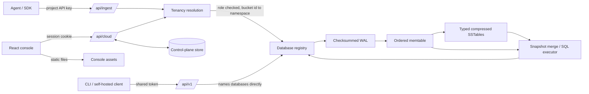

# Architecture and engineering notes

FluxDB is a single-process, single-node time-series database with a
multi-tenant control plane on top. Rust owns persistence, query execution,
authorization and - in a deployment - serving the browser console's static
files. There is no reverse proxy in the deployment: one process, one port.

Three request surfaces reach the same engine:

- **`/api/cloud`** - the console, authenticated by a session cookie. Data is
  addressed as project plus bucket; the caller can never name a database.
- **`/api/ingest`** - agents and SDKs, authenticated by a project API key with
  read and write scopes.
- **`/api/v1`** - the single-tenant surface, authenticated by one shared token.
  It names engine databases directly and so sits *underneath* the tenancy
  boundary, which is why a server with accounts enabled always keeps a token in
  force. This is what a self-hosted deployment and the offline CLI use.

## Data and consistency

A database contains measurements. Each series is identified by a measurement and a sorted complete set of string tags. A point identity is `(series, signed i64 nanosecond timestamp)`. Fields are float64, signed i64, string, or boolean. JSON timestamps and integer wrappers avoid JavaScript's 53-bit integer limit.

Writes to the same identity merge fields, with later supplied values winning. An empty internal field set is a tombstone; public writes cannot create one. Range deletion and retention persist tombstones so old SSTable values cannot reappear after restart. Deleting and then writing the same identity creates a new point without resurrecting deleted fields.

Each database has an operation read/write lock. Mutation, flush, and compaction take the write lock; queries and snapshots take a read lock. A query sees a coherent in-process view. A batch is validated before WAL append and becomes visible together under the operation lock. This does not provide multi-request or multi-database transactions.

The engine serializes database registry changes and holds filesystem locks on the data root and opened databases. Drop refuses a database with active external references, closes Windows file mappings, renames its directory to a hidden deletion directory, then reclaims files. A failed rename attempts to reopen the unchanged database. Hidden deletion directories left by a crash are ignored at startup and can be removed offline after confirming they are obsolete.

## Write path and recovery

1. Validate the full input batch and resolve field merges against the newest visible version.
2. Append one checksummed WAL record; the server's default policy syncs it immediately.
3. Publish the batch into the ordered memtable.
4. When the size threshold is reached, retain an immutable memtable until its SSTable is safely written and published.

The current `FLX2` SSTable stores sorted typed points, serialized with bincode, compressed with LZ4, and protected by CRC32. It preserves strings, booleans, and full-width integers. A reader for the previous format remains for existing files, but it cannot reconstruct types or values that an older writer already discarded. Back up old databases before migrating; new files cannot be read by old binaries.

Pending files are written and synced before rename. On Unix, publication also syncs the parent directory. Power-loss guarantees still depend on filesystem and device behavior; Windows does not use the same directory-sync mechanism. The suite tests process interruption and recovery, not every possible hardware failure.

Recovery validates record lengths and checksums. An incomplete final WAL record is truncated before future appends. A complete record with an invalid checksum fails startup instead of silently dropping data. SSTable/manifest corruption also fails startup. Diagnose and restore a backup rather than removing corrupt files blindly.

## Compaction checkpoint

Compaction merges all visible point versions and removes tombstones. It rotates the WAL, writes a new full snapshot SSTable, and atomically publishes a manifest containing `(snapshot_id, first_required_wal_segment)`. Only after publication does it switch the in-memory table set and reclaim obsolete files.

On recovery, the manifest selects the snapshot and newer tables and limits WAL replay to required segments. If a crash occurs before manifest publication, old data and WAL remain authoritative. If it occurs after publication, the new snapshot is authoritative. A manifest referencing a missing table is an error.

Automatic compaction runs when eight SSTables accumulate. Manual compaction is exposed through HTTP and the offline CLI. Retention maintenance runs approximately once per minute and compacts after expiring points. It uses the server clock and a strict `timestamp < cutoff` condition.

## Query execution

SQL is parsed by `sqlparser`, converted to an internal plan, and executed over the merged visible snapshot. Typed predicates preserve exact integer equality and implement missing-value three-valued logic for AND, OR, and NOT. Time comparisons preserve strict versus inclusive bounds. Time buckets use Euclidean division, including timestamps before the Unix epoch.

The public query endpoint accepts one SELECT statement. It supports field/tag projection, predicates, aggregates, DISTINCT, one ordering key, LIMIT/OFFSET, tag grouping, and quoted fixed intervals such as `time('1m')`. It does not execute JOINs, subqueries, set operations, computed expressions, HAVING, or arbitrary SQL DDL/DML. Use HTTP operations for mutations.

The storage format contains exact values, but numeric aggregate calculations use floating-point arithmetic. Avoid treating an aggregate sum of very large integers as an exact accounting result.

## Control plane and tenancy

The engine knows only about databases. Accounts, organizations, projects,
buckets, roles, API keys, dashboards, monitors and the audit trail live in the
control plane, and the boundary between them is a naming rule.

Each project owns the prefix `t{project_id}_` of engine database names, where
`project_id` is twelve base-32 characters. A bucket record stores both its
user-facing name and its physical `namespace`. Resolving a request means: look
up the bucket by id, confirm it is a child of the named project, look up the
caller's membership in that project's organization, check the role against the
operation, and only then open `namespace`. No code path accepts a database name
from a caller.

Two consequences are worth stating. Unauthorized reads answer 404 rather than
403, so project and bucket ids cannot be probed for existence. And bucket names
are validated against the engine's character set and length budget at creation
time - 48 characters, leaving room for the prefix inside the engine's 64-byte
limit - so a namespace can never be constructed that the engine would reject
later.

Roles are ordered: viewer reads; member also writes and manages buckets,
dashboards and monitors; admin also manages projects, API keys and members;
owner also renames and deletes the organization. The shared showcase project is
marked `demo` and refuses every mutation regardless of role.

### The metadata store

Control-plane volume is small and its records are read far more often than they
are written, but it has one hard requirement: it must run unchanged on a
developer's laptop and on managed Postgres, because a hosted container's
filesystem does not survive a redeploy and losing accounts is not a survivable
failure.

Records are therefore stored as typed JSON documents in a single table with
explicit secondary index columns - `kind`, `id`, `parent`, `owner`, `lookup` -
and all validation lives in typed Rust structs. SQL is limited to the subset
both engines accept, which keeps exactly three functions backend-specific
(execute, fetch, count) instead of every query. Placeholders are written `?` and
rewritten to `$n` for Postgres.

Uniqueness is enforced by a unique index on `(kind, lookup)` rather than by
read-then-write checks: duplicate email addresses, organization slugs, bucket
names within a project and API key ids are all races the database wins. NULL
lookups are distinct in both engines, so records with no natural key simply do
not participate.

The trade-off is that there are no foreign keys and no relational queries over
control-plane data. Cascading deletes are written explicitly, and a stranded
record is logged rather than silently left. For this volume that is the right
exchange; a control plane with reporting requirements would want real tables.

### Sessions and credentials

Passwords use Argon2id with per-password salts. Sign-in is rate limited per
account and per client address by in-process fixed-window counters, and the
unknown-account branch verifies against a fixed dummy hash so a missing account
cannot be distinguished by response timing.

A session is a 256-bit random token in an `HttpOnly`, `SameSite=Lax` cookie,
with `Secure` applied whenever the deployment is reached over HTTPS. Only the
SHA-256 of the cookie value is stored, so a leaked control-plane database does
not hand over live sessions. `SameSite=Lax` blocks cross-site form posts, and
mutating requests additionally have their `Origin` checked against the
deployment's base URL and the configured browser origins.

API key secrets are 256 random bits stored as a SHA-256 digest. A
password-stretching KDF is deliberately not used: it would add tens of
milliseconds to every ingest request and buys nothing against a secret of that
size. Revocation marks the key rather than deleting it, so its audit trail and
last-used time survive. Last-used is written at most once a minute so metadata
updates do not slow ingestion.

GitHub sign-in uses the authorization-code flow. The state parameter carries a
nonce and the return path and is HMAC-signed; the nonce is also set as a
short-lived cookie and compared on return, so a state value replayed in another
browser fails. Return paths are restricted to same-origin paths, which closes
the open redirect that an OAuth round trip otherwise invites.

### Guest workspaces

A guest account is created without credentials, gets its own organization with a
private writable sandbox seeded from the sample generator, and expires after 24
hours. A background sweep reclaims expired accounts and everything below them,
including their engine databases. Anonymous creation is rate limited per address
and capped globally, so the shared instance's working set stays bounded.

Guests also receive viewer membership in the shared showcase organization, which
is how every visitor - guest or registered - sees the same read-only fleet.

### Monitors

A monitor is a stored query, a comparison and a threshold. One background sweep
per minute evaluates every enabled monitor by running its query and taking the
first numeric cell of the first row. A query returning no rows leaves the
monitor in `unknown` rather than treating absence as zero, because "no data" and
"zero" mean different things when something has stopped reporting.

Only state transitions are recorded, so a monitor that stays in breach produces
one alert rather than one per sweep, and the first evaluation of a healthy
monitor is not announced as a recovery. A monitor's query is validated by
running it once at creation, so it cannot be saved in a state where it silently
never evaluates. There is no delivery mechanism - alerts are recorded and shown
in the console; mail or webhooks would be the next thing to add.

### Query macros

The SQL subset has no `now()`, so a stored query carries no notion of "recent".
The query endpoints expand `$timeFilter`, `$interval`, `$from` and `$to` from
the range the caller sends, and echo the resolved window back in the response.
That is what lets one saved dashboard panel serve every range, and it means a
chart's axis and its data can never disagree. Accepted interval widths are an
explicit list, so a caller cannot ask for a width that would materialize
millions of groups.

The same substitution exists in the browser for self-hosted connections,
because a self-hosted server knows nothing about the macros. Keeping one
implementation on each side is deliberate: a panel must render identically
wherever its data lives.

### Self-hosted connections

The console can target a FluxDB the visitor runs. Two modes, with different
trust:

**Browser-direct** is the default and the right choice for a server on the
visitor's own machine. The browser talks to it over `/api/v1`; the token is held
in memory for the tab, is never written to storage and never reaches the host
serving the console. The cost - re-entering it after a reload - is stated in the
UI rather than hidden.

**Proxied** exists for a server the browser cannot reach directly. The control
plane forwards the request, with the token supplied per request and never
stored. Only `/api/v1` paths and the documented methods are forwarded, response
bodies are size-capped, and the target is resolved and screened against
private, loopback, link-local and carrier-grade-NAT ranges before each forward.
Without that screening a proxy endpoint is an SSRF primitive pointed at the
deployment's own network.

## HTTP, security, and observability

The versioned API has a 2 MiB body limit, 10,000-point batch limit, paginated reads up to 1,000 points, and a 32-request concurrency gate. Saturation returns 429. Input errors return structured errors; authentication failures return 401. CRUD handlers run storage work on Tokio's blocking pool.

Bearer authentication on `/api/v1` is optional only for a loopback-bound server with the control plane switched off. It is mandatory for any non-loopback bind, and mandatory whenever accounts exist - if the operator sets no token in that case, one is generated and logged at startup, because that surface names engine databases directly and an anonymous request there would return any account's data. One `/api/v1` token grants server-wide administration: it has no users, scopes or read-only variants. Per-account and per-project authorization is the control plane's job. CORS is an explicit browser-origin allowlist, not an authentication boundary.

When `FLUXDB_STATIC_DIR` is set the server also serves the console: hashed asset paths are immutable for a year, `index.html` is never cached, and unknown paths fall back to `index.html` with a 200 so a deep link reaches the browser router. Unmatched paths under `/api` answer a JSON 404 instead, so a broken client gets something it can parse. The static service is deliberately composed outside the administration-token middleware - the browser has to fetch the application shell before anyone has signed in.

Request telemetry stores the latest 2,000 samples in memory. Each sample includes server duration, route, database when applicable, timestamp, and status. Health, stats, and telemetry polling are excluded. Other browser requests, including schema/data refreshes, count as real traffic. Samples reset on process restart and do not constitute a persistent monitoring system.

The console classifies query results rather than being configured with a schema: a result with a time column becomes one series per tag value, a result without one becomes categories, and a result with no numeric column is reported as unplottable. Charts read their colours from CSS custom properties and are recreated when the theme changes. ECharts is driven directly rather than through a React binding, with a `ResizeObserver` as the single source of truth for canvas size - a chart mounted before its container is laid out otherwise keeps drawing into the width it saw at initialisation. Tables retain exact nanosecond and integer strings even though chart axes use milliseconds.

## Scaling and operational boundaries

The current SSTable reader materializes typed points, and queries, schema scans, statistics, and snapshots allocate merged views. This is intentionally a small single-node implementation; memory, scan cost, and serialized mutation are practical limits. There is no distributed consensus, replication, sharding, failover, multi-user authorization, streaming export, or query cancellation on client disconnect.

Snapshot export is a consistent logical view, but restore is a sequence of batches into a new database. Request failures after a durable write can leave the client uncertain whether a mutation committed; inspect the point identity before retrying. Upserting identical point identities is safe for repeated value assignment. Retention and deletion are destructive and should be backed by tested snapshots.

The repository includes regression tests, an isolated authenticated end-to-end harness, SDK checks, a reproducible HTTP benchmark, container definitions, and CI configuration. These provide reviewable evidence; they do not substitute for load testing, fault injection, independent security review, or successful deployment-host validation.

## Gemini agent

The assistant is reachable wherever `/api/v1` is: a self-hosted server, or a
deployment whose operator holds the administration token. It has not been
extended to tenant-scoped buckets, so accounts on a hosted deployment do not see
it. Making it tenant-aware means resolving a bucket id to a namespace before the
tool loop runs and mapping proposed operations back to bucket names on the way
out.

The browser calls the authenticated `/api/v1/assistant/chat` route. Rust sends the bundled project instructions, selected database/page, and bounded conversation to Gemini's native generateContent function-calling API. The provider host is fixed; redirects and arbitrary provider URLs are disabled. A server `GEMINI_API_KEY` or per-request `x-gemini-api-key` supplies credentials. Secrets are never returned, persisted by the assistant, or logged. Browser session keys are memory-only; server keys are loaded from environment or a local .env at startup.

The tool loop preserves native model content and thought signatures between calls. `inspect_schema` returns names, types, tag keys, and counts. `read_query` requires explicit row-sharing consent, a SELECT plan, LIMIT 1..100, and a bounded serialized response. These limits bound returned context, not total storage scan cost. `propose_operation` validates allowlisted typed payloads and scope but never mutates storage. The browser displays the proposal and executes reviewed actions through the existing authenticated database endpoints. Destructive operations require the database name; successful cards cannot be executed twice. Lost responses still require checking actual state before retrying.

At most four Gemini turns and eight tool calls run per request, with four simultaneous assistant requests, 45-second provider timeouts, and a 100-second overall deadline. Up to 16 messages / 48 KiB of input are accepted. Canceling generation stops the browser wait; server work can continue until its own deadline, and completed reads are not undone. No shell, filesystem, arbitrary network, or repository-edit tools are exposed. Replies are text, not executable HTML. Switching database clears conversation and proposals. Export downloads remain local; local result previews enter later model context only when row sharing is enabled.

The prompt limits responses to FluxDB, but language-model compliance is probabilistic. Host-side scope checks, typed validation, read consent, and explicit mutation review enforce the execution boundaries. This is not multi-user authorization: a valid FluxDB token still grants server-wide administration.
